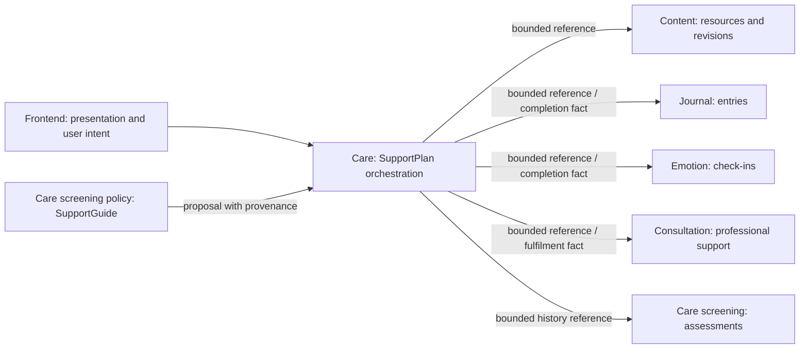

# ADR: SupportGuide and SupportPlan v3 product boundary

- Status: **proposed for MB-637 review**
- Decision gate: accepted only when PR #129 is approved and merged
- Scope: SupportGuide, SupportPlan, and cross-domain action semantics
- Date: 2026-10-11
- Owning domain: Care
- Follow-up implementation: MB-638, MB-639, MB-646, and MB-647

## Context

The v2 SupportPlan contract models a plan primarily as resource slots. That
contract remains a supported runtime contract, but it cannot express the wider
set of actions required by a longitudinal wellbeing plan without making
Resource the accidental owner of Journal, emotion, professional-support, and
screening behavior.

MB-637 is the decision gate that separates the two product jobs and freezes the
v3 language before the v3 persistence/API work begins. The four-mode workspace
in PR #129 is presentation ahead of the new domain model: it still reads and
writes the v2 resource-slot contract and is not canonical evidence of v3
`PlanAction` semantics. No runtime implementation becomes canonical from this
document until the decision gate above is accepted.

## Product boundary

### SupportGuide

SupportGuide answers **“What should I do next?”** for one screening context. It
explains the result in non-diagnostic language and presents a small number of
policy-approved next steps. It is guidance, not a commitment, schedule, task
tracker, or longitudinal record. Following a guide link does not silently add
an action to SupportPlan.

User-facing example:

> Kết quả hôm nay gợi ý bạn ưu tiên trao đổi với chuyên gia. Bạn cũng có thể
> xem một bài hướng dẫn ngắn trong lúc chờ đặt lịch.

The example is tied to the screening that produced it. It does not claim that
the user has started or completed a plan.

### SupportPlan

SupportPlan answers **“What will I do over the next days or weeks, why, and how
will I review it?”** It is an explicit, user-controlled collection of focuses,
typed actions, optional schedules, and immutable occurrence history. Guidance
may propose an action, but the user must accept it before Care adds it to the
plan. The user can later adjust future plan behavior without rewriting past
facts.

User-facing example:

> Trong hai tuần tới, tôi sẽ ghi nhật ký vào tối thứ Ba, kiểm tra cảm xúc mỗi
> sáng và đặt lịch trao đổi với chuyên gia. Cuối tuần tôi sẽ xem lại điều gì hữu
> ích và điều chỉnh tuần tiếp theo.

SupportPlan coordinates these intentions. It does not take ownership of the
journal entry, emotion value, appointment, or screening answers produced in
their source domains.

## Canonical model

The following terms are canonical across backend contracts, frontend models,
documentation, and analytics:

1. **SupportPlan** — the user-controlled longitudinal container, lifecycle, and
   revision boundary.
2. **PlanFocus** — a plain-language area the user chooses to work on and why it
   matters. It is not a diagnosis, clinical outcome, or score.
3. **PlanAction** — a typed intention within one focus. An action has its own
   identity and may reference a source-domain object; it is not a Resource
   subtype.
4. **ActionSchedule** — an optional rule for future opportunities or reminders,
   including timezone. Editing a schedule affects only future occurrences.
5. **ActionOccurrence** — one immutable, dated instance of an action. Its
   recorded outcome is `COMPLETED` or `SKIPPED`; an open past-due occurrence is
   displayed as overdue but is not silently converted into failure.

`PlanFocus -> PlanAction -> ActionSchedule -> ActionOccurrence` is the canonical
relationship. A Resource is one possible source for a `PlanAction`, never the
parent abstraction for every action type.

### Common Care-owned envelope

Care may persist the following bounded SupportPlan data:

- plan, focus, action, schedule, and occurrence identifiers;
- canonical action type, ordering, lifecycle, and plan revision;
- user-authored focus, action label, short rationale, and optional instructions;
- schedule rule, timezone, start/end boundaries, and future reminder settings;
- a source reference containing only owner domain, opaque source ID, and an
  optional source revision or policy version;
- provenance category (`USER_SELECTED`, `SUPPORT_GUIDE`, `SPECIALIST`, or
  `SYSTEM_POLICY`) and the policy/version reference needed to audit a proposal;
- occurrence outcome, timestamp, evidence kind, and a bounded evidence
  reference to the owner-domain fact;
- consent/audit metadata required to prove who accepted or changed the plan.

The action type and source identity are immutable after activation. Replacing
either ends the old action and creates a new action in a later plan revision.
Labels, rationale, ordering, and future schedules may change through a new
revision. Completed or skipped occurrences and their evidence are immutable.

## Approved action taxonomy

API-safe enum names are canonical. The slash forms used in product prose are
labels, not additional types: `ROUTINE_SELF_MANAGEMENT`,
`REASSESSMENT_SCREENING`, and `SELF_REPORT_REVIEW`.

| Action type               | Intent                                                                                       | Owner and authoritative provenance                                                                                                  | Completion evidence                                                                                            | Scheduling and outcome behavior                                                                                                                                                    | Privacy boundary                                                                                         | Mutable plan fields                                                                                          | What Care may persist                                                                                                               |
| ------------------------- | -------------------------------------------------------------------------------------------- | ----------------------------------------------------------------------------------------------------------------------------------- | -------------------------------------------------------------------------------------------------------------- | ---------------------------------------------------------------------------------------------------------------------------------------------------------------------------------- | -------------------------------------------------------------------------------------------------------- | ------------------------------------------------------------------------------------------------------------ | ----------------------------------------------------------------------------------------------------------------------------------- |
| `RESOURCE`                | Read, watch, or practise with reviewed content.                                              | Content owns the resource and revision; provenance is the Content resource ID/revision or the SupportGuide policy that proposed it. | Explicit user acknowledgement for the occurrence. Opening content alone is not completion.                     | Schedulable; user-completable and skippable; not externally satisfied; not review-only.                                                                                            | No private Content payload is copied.                                                                    | Label, rationale, order, and future schedule. The linked resource is replaced only by creating a new action. | Common envelope plus resource reference/revision and a minimal display snapshot needed to keep old plans understandable.            |
| `JOURNAL`                 | Create a reflective journal entry without exposing its contents to the plan.                 | Journal owns entries and their timestamps; provenance is a Journal capability/template reference or the proposal policy.            | A bounded Journal entry reference and occurred-at time. Care never infers completion from draft text.          | Schedulable and skippable; externally satisfied by Journal; not manually marked complete while linked; not review-only.                                                            | Entry body, AI reflection, tags, and mood remain in Journal.                                             | Label, rationale, order, optional prompt reference, and future schedule.                                     | Common envelope plus opaque entry/template reference and completion timestamp; never journal content.                               |
| `EMOTION_CHECK_IN`        | Invite the user to record how they feel in the Emotion domain.                               | Emotion owns the check-in fact; provenance is an Emotion capability reference or proposal policy.                                   | Opaque check-in reference and occurred-at time from Emotion.                                                   | Schedulable and skippable; externally satisfied by Emotion; not manually marked complete while linked; not review-only.                                                            | Emotion value, notes, interpretation, and trend data remain in Emotion.                                  | Label, rationale, order, and future schedule.                                                                | Common envelope plus opaque check-in reference and completion timestamp; never the reported emotion or notes.                       |
| `ROUTINE_SELF_MANAGEMENT` | Carry out a user-chosen everyday wellbeing routine that has no source-domain object.         | Care owns the action definition; provenance is the user, specialist, or proposal policy that introduced it.                         | Explicit user acknowledgement with timestamp.                                                                  | Schedulable; user-completable and skippable; not externally satisfied; not review-only.                                                                                            | Store only the user-approved plan wording; do not reinterpret it as medical adherence.                   | User wording, rationale, instructions, order, and future schedule through a new revision.                    | Common envelope plus the bounded user-approved routine text and manual completion evidence.                                         |
| `PROFESSIONAL_SUPPORT`    | Reach or attend an appropriate professional-support pathway.                                 | Consultation owns appointment/service facts; Care owns only plan orchestration and routing provenance.                              | Linked Consultation status such as attended/completed. A reminder dismissal must not claim that care occurred. | A plan reminder is schedulable and skippable. Linked fulfilment is externally satisfied by Consultation; appointment time/status cannot be edited in SupportPlan; not review-only. | Appointment notes, messages, clinical details, disputes, and entitlements remain in their owner domains. | Label, rationale, order, future reminder schedule, and replaceable pathway reference before activation.      | Common envelope plus bounded service/appointment reference, routing policy version, and non-clinical fulfilment status/timestamp.   |
| `REASSESSMENT_SCREENING`  | Invite a policy-appropriate reassessment or screening.                                       | Care screening owns questionnaire, policy, and immutable result history.                                                            | Assessment-history reference, questionnaire version, and completion time.                                      | Reminder is schedulable and skippable; completion is externally satisfied by Care screening; not manually completed; not review-only.                                              | Item answers, raw scores, and protected result payloads are not copied into the plan.                    | Label, rationale, order, questionnaire reference before activation, and future reminder schedule.            | Common envelope plus assessment-history/questionnaire reference and completion time; no answers or raw score.                       |
| `SELF_REPORT_REVIEW`      | Ask the user to review the plan and record a plain-language reflection or adjustment choice. | Care owns the review event; provenance is the schedule, user request, or policy that requested review.                              | Explicit user-submitted review event and timestamp.                                                            | Schedulable; user-completable and skippable; not externally satisfied; **review-only** and never converted to an outcome score.                                                    | Reflection text is optional, user-controlled Care data and is not shared cross-domain by default.        | Prompt/label, rationale, order, future schedule, and user response until submission.                         | Common envelope plus bounded prompt, submitted response when explicitly provided, and review timestamp; no derived wellbeing score. |

### Capability summary

| Action type               | Schedulable   | User complete      | User skip        | External satisfaction | Review-only |
| ------------------------- | ------------- | ------------------ | ---------------- | --------------------- | ----------- |
| `RESOURCE`                | Yes           | Yes                | Yes              | No                    | No          |
| `JOURNAL`                 | Yes           | No when linked     | Yes              | Journal               | No          |
| `EMOTION_CHECK_IN`        | Yes           | No when linked     | Yes              | Emotion               | No          |
| `ROUTINE_SELF_MANAGEMENT` | Yes           | Yes                | Yes              | No                    | No          |
| `PROFESSIONAL_SUPPORT`    | Reminder only | No for linked care | Yes for reminder | Consultation          | No          |
| `REASSESSMENT_SCREENING`  | Reminder only | No                 | Yes for reminder | Care screening        | No          |
| `SELF_REPORT_REVIEW`      | Yes           | Yes                | Yes              | No                    | Yes         |

Skipping records only the user's decision for that occurrence. It does not
cancel an appointment, delete an entry, revoke consent, alter a screening fact,
or mark the overall plan as unsuccessful. External owner domains publish or
expose only the minimum completion fact needed by Care; Care does not scrape or
reconstruct completion from raw payloads.

## Professional-support routing

When the authoritative screening/routing policy classifies a context as
moderate or higher and requires professional support, SupportGuide presents the
professional-support pathway as the primary next step. Self-help resources may
remain visible only as complementary support and must not be described as an
equivalent replacement or as a reason to delay professional or urgent help.

If the user accepts that pathway into SupportPlan, Care creates a
`PROFESSIONAL_SUPPORT` action with the routing policy provenance. Consultation
remains authoritative for availability, booking, appointment state, and
fulfilment. SupportPlan never turns a resource view, reminder dismissal, or
self-report into evidence that professional care occurred.

This routing language is non-diagnostic. Existing urgent/crisis escalation
policy always takes precedence over plan creation or self-help suggestions.

## Domain and contract ownership

- Care owns SupportPlan, PlanFocus, PlanAction, ActionSchedule,
  ActionOccurrence, plan revisions, user plan intent, and review events.
- Content, Journal, Emotion, Consultation, and Care screening retain their own
  domain facts and authorization rules.
- The frontend uses the canonical enum names and Care-owned read model. It may
  navigate to an owner-domain flow, but it cannot synthesize owner-domain facts.
- SupportGuide may propose actions with provenance. Only explicit user intent
  (or an authorized specialist flow defined by later policy) may add/change a
  plan.
- AI may explain or propose. It cannot create, activate, reorder, complete,
  skip, replace, or delete plan actions without explicit user confirmation.

## v2 to v3 compatibility decision

Compatibility uses an **adapter/read-model translation**, not destructive
history migration.

1. Existing v2 resource-backed plans remain readable and operable under their
   current v2 contract during the transition.
2. Existing v2 plans, slots, occurrences, completions, skips, revisions, and
   lifecycle history are immutable historical facts. They are never rewritten
   into newly generated v3 rows or IDs.
3. At the v3 read boundary, a v2 slot may be projected as a compatibility
   `RESOURCE` PlanAction: `slot` becomes the virtual action, `selectedResource`
   becomes its Content source reference, and existing schedule/occurrence data
   becomes the virtual schedule and occurrence history.
4. That projection is explicitly marked `V2_RESOURCE_ADAPTER`; it is not proof
   that the v2 storage model is the canonical PlanAction model.
5. Before MB-639 lands, writes continue through the v2 contract. There is no
   speculative v3 dual-write, backfill, or cross-domain action persistence in
   this PR.
6. MB-639 owns the concrete v3 storage/API schema, adapter implementation,
   creation of native v3 actions, transition rules for editable v2 plans,
   contract rollout, and the compatibility-window exit criteria.
7. A later migration may materialize native v3 state only with a separate,
   auditable plan that preserves source IDs and immutable history. Read-model
   translation remains the default decision until that work proves migration
   is necessary.

Therefore the PR #129 workspace is allowed to present Today, Plan, Progress,
and Adjustments over v2 data, but those tabs and their local component names do
not define PlanAction business semantics. MB-639 must implement this ADR rather
than infer the v3 model from the current UI.

## Prohibited behavior

SupportGuide, SupportPlan, frontend code, backend code, analytics, and AI must
not:

- diagnose a condition or present a focus/action as a diagnosis;
- calculate or display treatment, adherence, recovery, or overall wellbeing
  scores from action completion, skips, streaks, or external facts;
- copy raw journal text, emotion values/notes, screening answers/raw scores,
  consultation notes/messages, or other owner-domain payloads into Care;
- treat opening content, dismissing a reminder, or visiting a route as proof of
  completion;
- rewrite or delete immutable occurrence, assessment, or v2 plan history;
- present self-help as the primary substitute when routing policy requires
  moderate/higher professional support;
- allow AI or an automated recommendation to mutate a plan without explicit,
  auditable user confirmation;
- let SupportPlan edits change source-domain facts such as appointments,
  journal entries, emotion check-ins, resources, or assessment results.

## Consequences

- Later stories can cite one taxonomy instead of inventing local action
  semantics.
- Care can coordinate a plan without becoming the owner of sensitive
  cross-domain payloads.
- Existing v2 plans remain safe and readable while MB-639 introduces the native
  v3 model.
- Some actions complete only through their owner domain; the UI must explain
  this instead of offering a misleading manual completion control.
- The accepted policy expands the domain model beyond Resource but does not, by
  itself, authorize a backend schema, API, migration, or autonomous AI feature.
