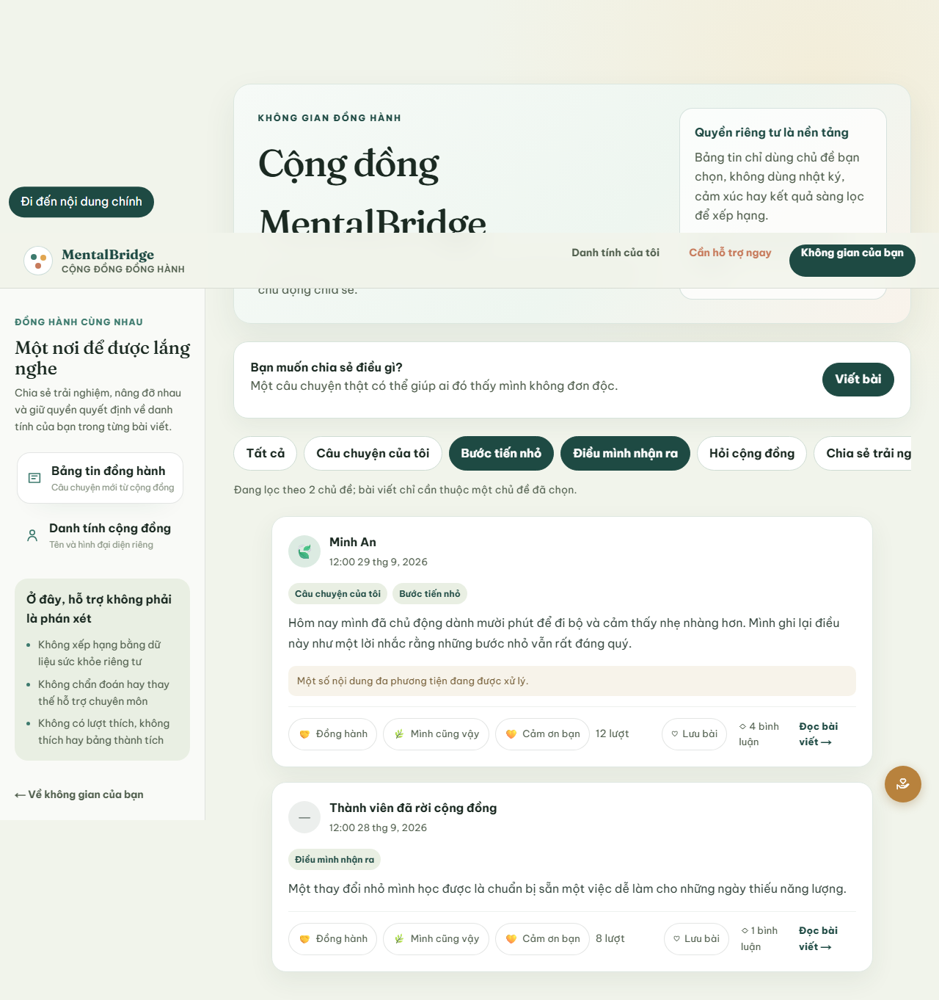

# MB-582 Community topic discovery evidence

## Delivered boundary

- Route and role: authenticated `USER` on `/community`.
- User job: browse the active governed Community vocabulary and narrow the newest-first feed by one, two, or three explicit topics.
- Filtering uses OR semantics: a post is included when it has at least one selected topic. Clearing the selection returns to the unfiltered newest-first feed.
- The Community topic catalogue is the only authority for visible filter choices and post composition. No free-form diagnosis or inferred topic is accepted.
- Care assessments, Journal text, emotion history, AI analysis, SupportPlan data, and inferred severity are excluded from the request, response, filtering, and ordering paths.

## State and interaction coverage

- Initial loading keeps the Community shell and feed hierarchy stable while the topic catalogue loads independently.
- An empty active catalogue keeps feed reading available, explains why filtering and new posting are unavailable, and disables the post composer entry point.
- A catalogue dependency failure leaves the feed usable and provides an in-place retry that does not reset feed content.
- Filter-empty results preserve the selected topic controls and invite the user to change the filter.
- Selection state uses `aria-pressed`, remains keyboard-operable, announces the OR rule in a live status, and disables only additional unselected topics after the three-topic bound is reached.
- Existing post topic labels remain readable even if a topic is later deactivated; inactive topics are not offered as new filter or composer choices.

## Contract and automated evidence

- Community OpenAPI v1.7 defines repeated `topic` query values with one-to-three, unique, governed codes and documents OR matching.
- The same-origin BFF validates the bound, rejects duplicate, unknown, profiling, and unrelated parameters, and forwards repeated values without widening the browser boundary.
- Runtime response validation accepts zero to six unique active catalogue entries, so deactivation is represented as absence rather than malformed data.
- Component tests cover multiple selected topics, pagination isolation, empty catalogue, independent catalogue failure/retry, and filter-empty recovery.
- The deterministic Playwright Community journey selects two topics and verifies that posts matching either topic remain discoverable.

The deterministic fixture above shows the OR-filter status, both selected topic controls, and posts matching either governed topic. It contains no production user data.

## Known limits

- Topic governance is Community-owned backend data seeded by Liquibase. An administrator UI for activating, deactivating, or editing governed copy is outside MB-582.
- Filter state is local to the Community page in v1; shareable filter URLs and free-text search are outside the frozen bounded scope.
