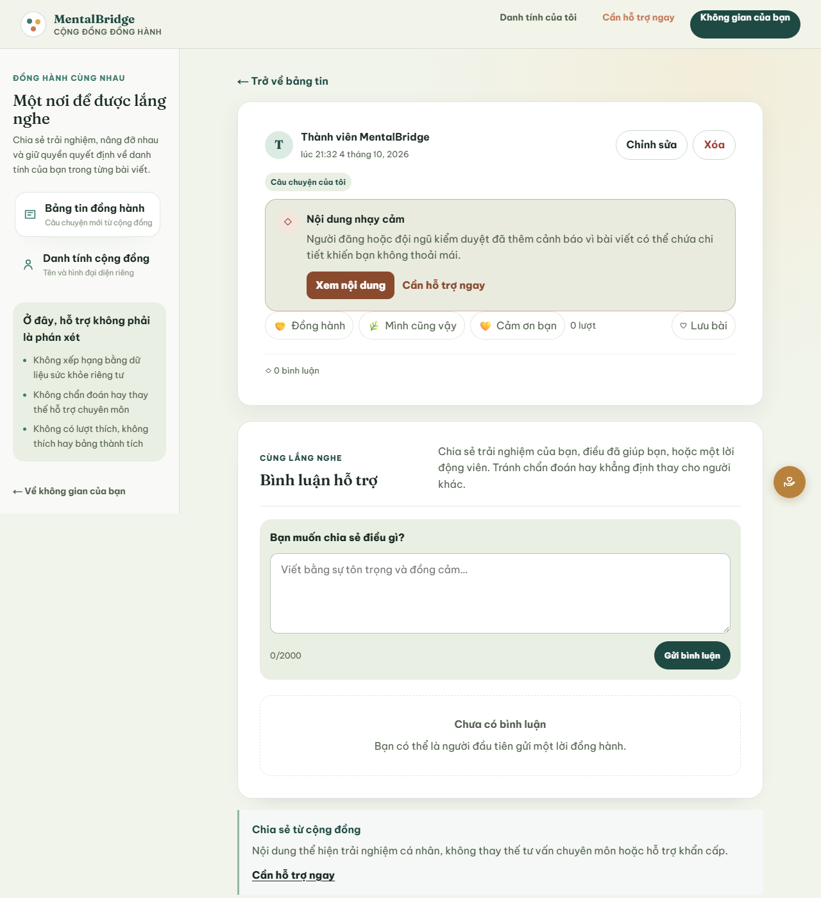
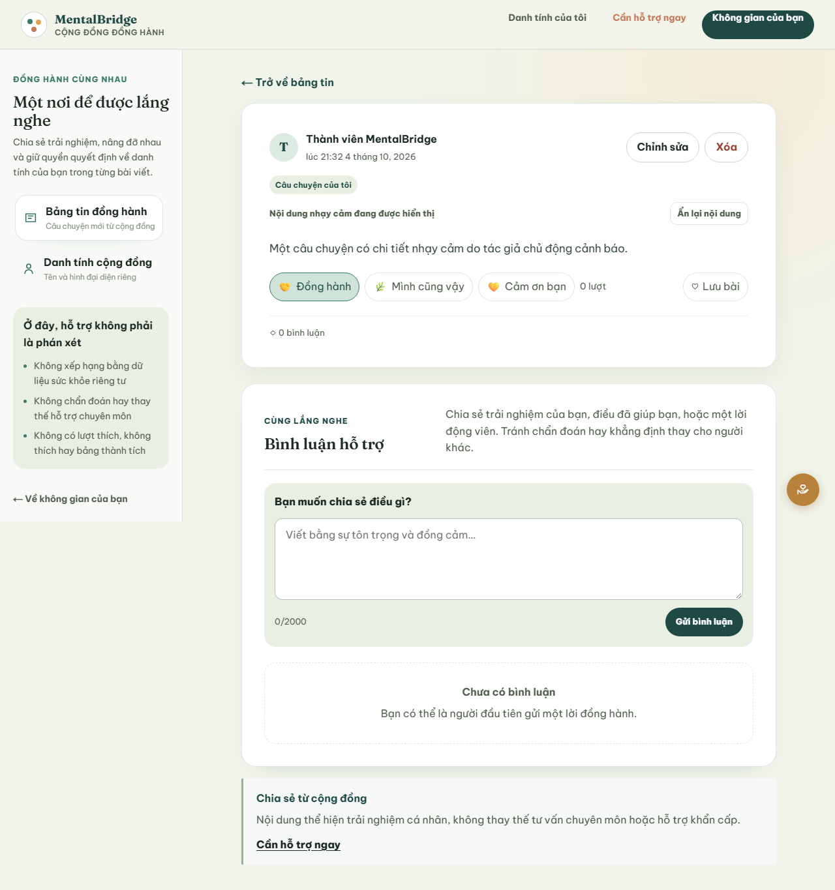

# MB-615 Community sensitive-content warning evidence

## Delivered boundary

- An author can explicitly add or remove the single `SENSITIVE_CONTENT` warning while creating or editing an owned active post.
- An authorized moderator can apply or remove the same marker through the existing idempotent moderation command. Warning actions are offered only for post cases.
- Feed and detail conceal post body, media, availability notices, and reviewed-resource cards until that reader explicitly reveals the warned post.
- Topics, author projection, aggregate interaction controls, post-detail navigation, Report/Block actions, and the reviewed “Cần hỗ trợ ngay” route remain reachable without revealing the body.
- The warning is non-clinical governance metadata. The UI does not infer it from sadness, distress, sentiment, Care, assessment, Journal/AI, SupportPlan, diagnosis, or severity data.

## Accessibility and interaction evidence

- Reveal and hide-again controls are native buttons with `aria-expanded` and an associated content region.
- The warning uses readable text and a redundant label rather than color alone. Keyboard focus is visible.
- The presentation does not require motion. Existing reduced-motion rules continue to remove optional Community transitions.
- Disclosure state is local to each rendered post, so revealing one item does not reveal another item or persist an unintended global preference.

## Contract and automated evidence

- Community OpenAPI v1.9 carries only the optional nullable `SENSITIVE_CONTENT` marker and the two bounded moderation actions.
- Strict BFF validation normalizes an absent marker to `null`, accepts the single declared value, and rejects inferred or undeclared warning labels.
- Component coverage verifies concealed/revealed/unwarned states, author create/remove commands, moderator action scoping, safety-action reachability, and feed/detail behavior.
- The deterministic fixture-browser journey creates a warned synthetic post, reloads detail, verifies concealment, follows the explicit reveal, and captures both states.





These captures use only controlled synthetic content and are not live cross-stack evidence. Regenerate after a production build with:

```text
npm run build
npx playwright test tests/e2e/community-feed.spec.ts --workers=1
```

## Known limits

- V1 has one bounded warning category; free-form warning labels and automatic classifiers are intentionally excluded.
- The warning does not replace Community moderation lifecycle actions. Hidden and removed content continues to fail closed.
- Disclosure is intentionally per render and is not stored as a user profile preference.
